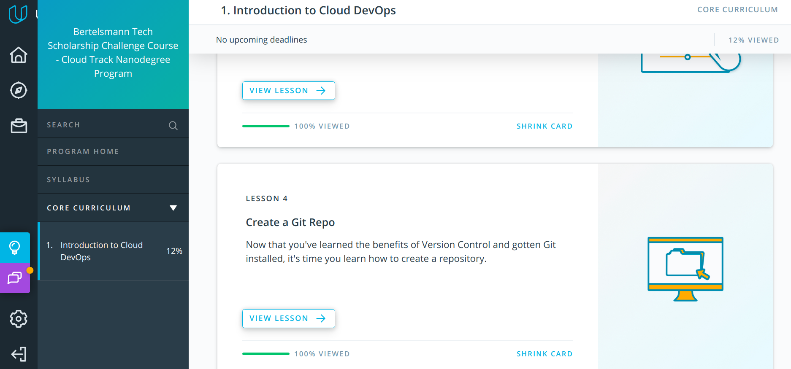
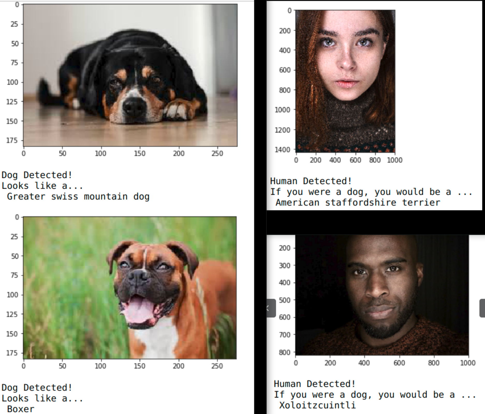
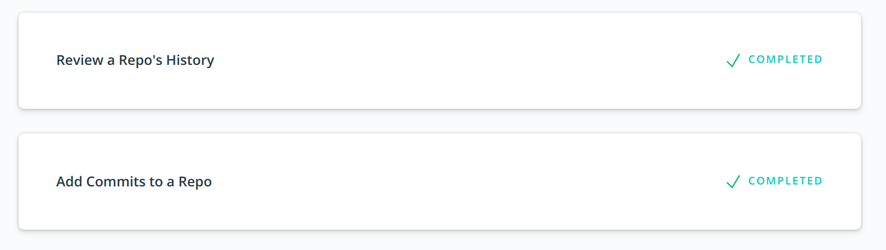

# 60 Days of Udacity (Bertellsman Cloud)

----------------------------
## Day 1

Started Lesson 1 on Shell Workshop

**What I learnt**
Learned the basics of organizing directories and navigating files.

---------------------------

## Day 2

Completed the Shell workshop 

**What I learnt**

- Downloding files with curl
- Removing files with rmdir, rm
- Viewing files with cat and less
- Started pushing my #60_days_udacity updates to a git repo https://github.com/ivyclare/60_Days_of_Udacity/blob/master/Cloud/ReadMe.md

Encouraging my friends from the previous nanodegree 

--------------------------------------

## Day 3

1) Completed Lesson 2 and 3 
2) Worked on Project 2 of DLND

**What I learned**
- An easy way to understand version control is thinking about it as "control version" i.e a software that helps you to control different versions of something
- Reconfigured my terminal for git to work
- Note To Self:  Use git status as often as possible until you get used to it
- Refresher on creating git repos, cloning and using git clone
- From DLND: Created my own CNN and used transfer learning (resnet, densenet , vgg net and inceptionV3 ) to create my architecute.  Code is running now, waiting for results.

Encouraging:

--------------------------------------

## Day 4

1) Completed and Submitted Project 2 of DLND
2) Started Lesson 5 - Review a Repo's History

**What I learned**
- Today I spent more time working on the Project **Dog Breed Classifcaiton**. I learned about using ResNet with Transfer Learning, trained my network and tested the model on the test set. As you can see in the image, when the model is given an image, it detects if the image is a dog or human or none. If it's a dog, it tells us what Dog Breed the dog is and if it detects a human face, it tells us what dog breed the human looks like.

- Also started learning about `git log` and `git show`

--------------------------------------

## Day 5
Completed Lesson 5 and 6 - (Review a Repo's History and Add Commits to a Repo)

**What I learned**
- I learnt how display a repo's history using `git log` and `git show`. Also learned about flags like `git log --oneline`, `git log --stat`, `git log -p`. Now, I can see what was stored in a commit, who stored it, when it was stored and much more. Using 

- From Lesson 6: 
I learned to use git add to stage content and used git commit to commit changes the repository. Also, how to write a good commit message and how to use git diff to recall changes that haven't been committed yet. Finally, learned how to use git ignore to tell git what files it should not track.
- **Note To Self:** Start commit messages with *"This commit will ..."*
- Also started making notes today
