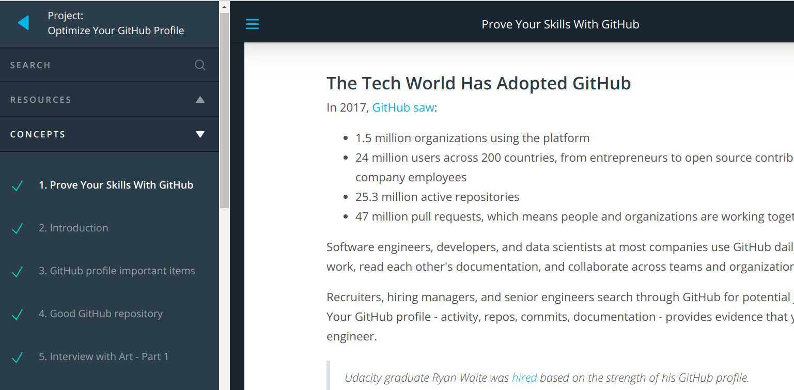
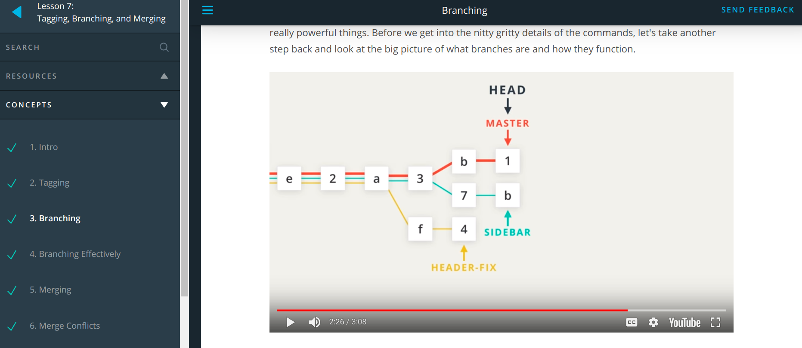
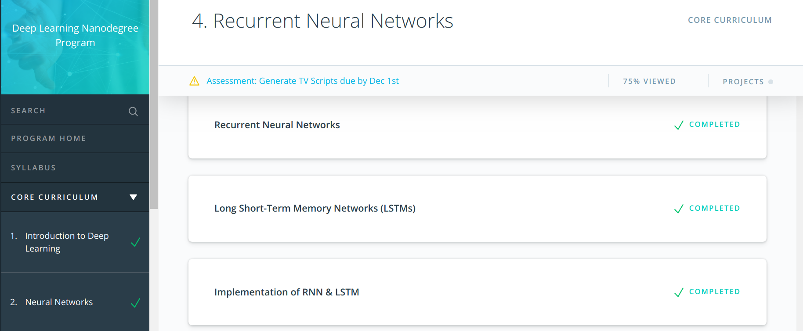

# 60 Days of Udacity (Bertellsman Cloud)
----------------------------
## Day 1

Started Lesson 1 on Shell Workshop

**What I learnt**
Learned the basics of organizing directories and navigating files.

---------------------------

## Day 2

Completed the Shell workshop 

**What I learnt**

- Downloding files with curl
- Removing files with rmdir, rm
- Viewing files with cat and less
- Started pushing my #60_days_udacity updates to a git repo https://github.com/ivyclare/60_Days_of_Udacity/blob/master/Cloud/ReadMe.md

Encouraging my friends from the previous nanodegree 

--------------------------------------

## Day 3

1) Completed Lesson 2 and 3 
2) Worked on Project 2 of DLND

**What I learned**
- An easy way to understand version control is thinking about it as "control version" i.e a software that helps you to control different versions of something
- Reconfigured my terminal for git to work
- Note To Self:  Use git status as often as possible until you get used to it
- Refresher on creating git repos, cloning and using git clone
- From DLND: Created my own CNN and used transfer learning (resnet, densenet , vgg net and inceptionV3 ) to create my architecute.  Code is running now, waiting for results.

Encouraging:

--------------------------------------

## Day 4

1) Completed and Submitted Project 2 of DLND
2) Started Lesson 5 - Review a Repo's History

**What I learned**
- Today I spent more time working on the Project **Dog Breed Classifcaiton**. I learned about using ResNet with Transfer Learning, trained my network and tested the model on the test set. As you can see in the image, when the model is given an image, it detects if the image is a dog or human or none. If it's a dog, it tells us what Dog Breed the dog is and if it detects a human face, it tells us what dog breed the human looks like.

- Also started learning about `git log` and `git show`

--------------------------------------

## Day 5
Completed Lesson 5 and 6 - (Review a Repo's History and Add Commits to a Repo)

**What I learned**
- I learnt how display a repo's history using `git log` and `git show`. Also learned about flags like `git log --oneline`, `git log --stat`, `git log -p`. Now, I can see what was stored in a commit, who stored it, when it was stored and much more. Using 

- From Lesson 6: 
I learned to use git add to stage content and used git commit to commit changes the repository. Also, how to write a good commit message and how to use git diff to recall changes that haven't been committed yet. Finally, learned how to use git ignore to tell git what files it should not track.
- **Note To Self:** Start commit messages with *"This commit will ..."*
- Also started making notes today

--------------------------------------

## Day 6
Completed videos on DL for Skin Cancer Detection , Jobs in DL and Optimizing my Github Profile

**What I learnt**
- ROC curves stand for **Receiver Operating Characteristic** is used to measure the performs of a classification task. It can also be called Specificity-Sensitivity curve. It works by plotting the True Positives against the True Negatives and find the area of the curve. 

- Amongst other things, contributing consistently to github and making sure the github graph is always green is very important cause this is the first thing that recruiters look at.

--------------------------------------
## Day 7
Completed Lesson 7 (Tagging, Branching and Merging)

**What I learnt**
- `git tag` which is used to add a tag to a commit
- `git branch` used to create branches. Also, learned to make changes on different branches in the demo project
- `git merge` where I merged the changes in the different branches
- Finally learned how to handle merge conflicts

-------------------------------------------
## Day 8
D8:
Completed RNN and LSTM lessons in DLND

**What I learned**
I revised the implementation of Recurrent Neural Networks and Long Short Term Memory.  Went over the implementation of a model that generates new text

---------------------------------------------
## Day 9
D9:
Completed Hyperparameters in DLND

**What I learned**
What I learned
Learnt about different hyperparameters that are used in defining and training deep learning models. Hyperparameters like learning rate, minibatch size, number interations and RNN hyperparameters

---------------------------------------------
## Day 10
D10:
Revisited LSTM

**What I learned**
I fell sick , so couldn't do much. I just revisited the concepts of LSTM

---------------------------------------------
## Day 11
D11:
Started Watching Videos for Embeddings and Word2Vec 

**What I learned**
Learning about using embeddings in natural language processing. 

