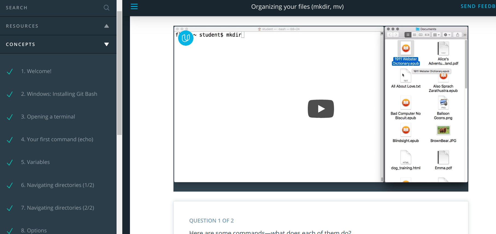
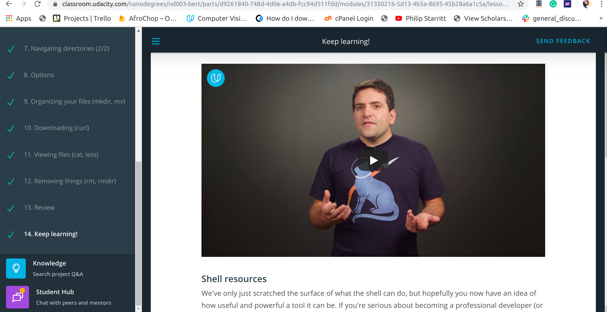

# 60 Days of Udacity (Bertellsman Cloud)

----------------------------
## Day 1

Started Lesson 1 on Shell Workshop

**What I learnt**
Learned the basics of organizing directories and navigating files.

---------------------------

## Day 2

Completed the Shell workshop 

**What I learnt**

- Downloding files with curl
- Removing files with rmdir, rm
- Viewing files with cat and less
- Started pushing my #60_days_udacity updates to a git repo https://github.com/ivyclare/60_Days_of_Udacity/blob/master/Cloud/ReadMe.md

Encouraging my friends from the previous nanodegree 

--------------------------------------

## Day 3

D3:
1) Completed Lesson 2 and 3 
2) Worked on Project 2 of DLND

**What I learned**
- An easy way to understand version control is thinking about it as "control version" i.e a software that helps you to control different versions of something
- Reconfigured my terminal for git to work
- Note To Self:  Use git status as often as possible until you get used to it
- Refresher on creating git repos, cloning and using git clone
- From DLND: Created my own CNN and used transfer learning (resnet, densenet , vgg net and inceptionV3 ) to create my architecute.  Code is running now, waiting for results.

Encouraging:

